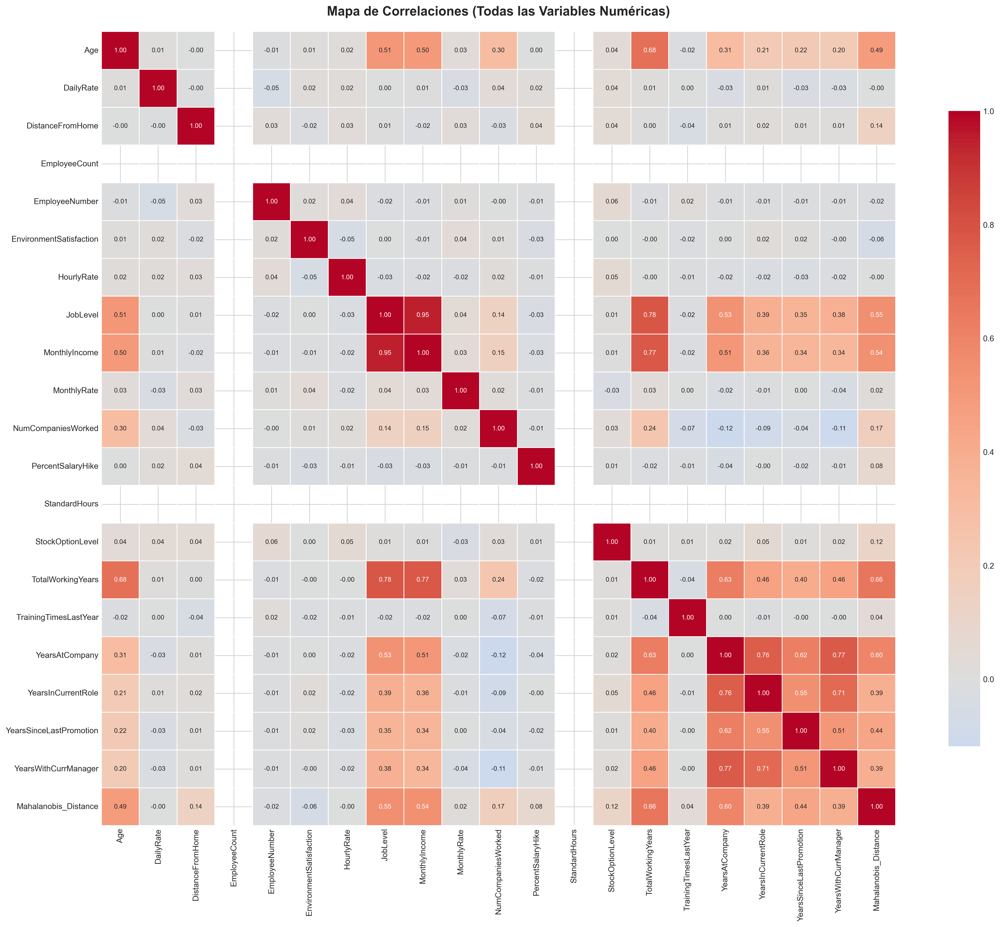
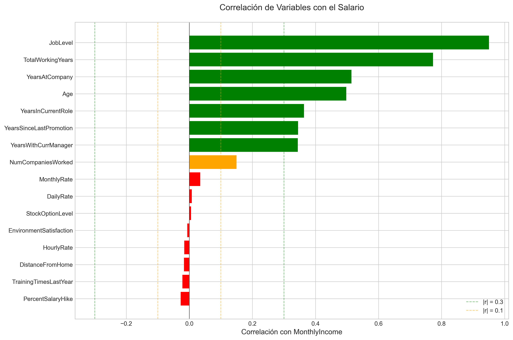
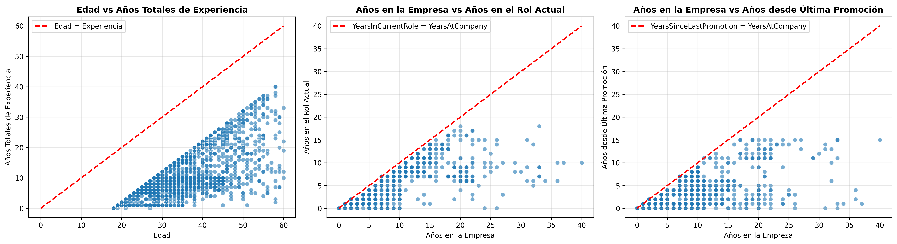
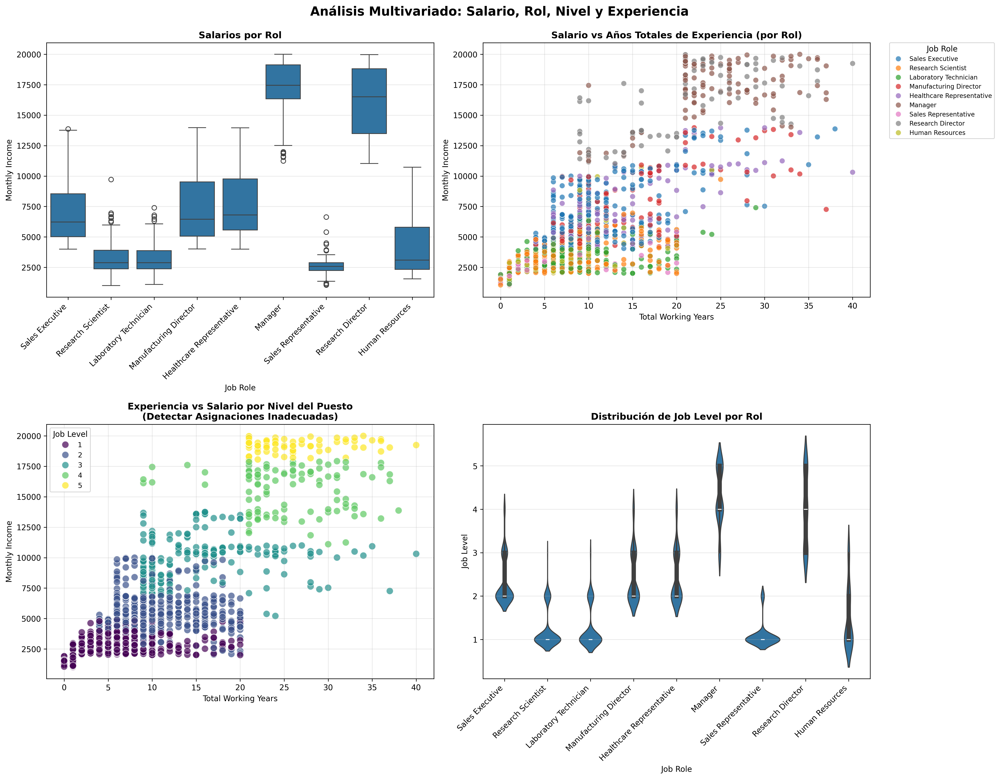
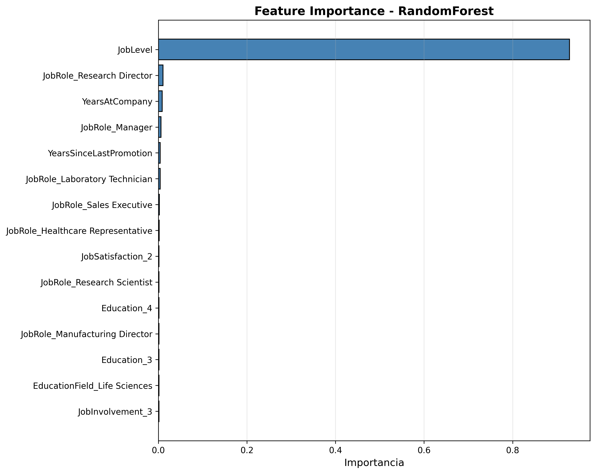
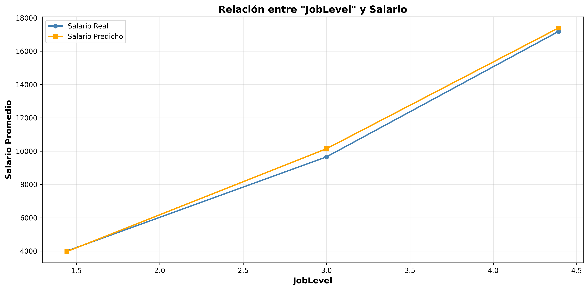
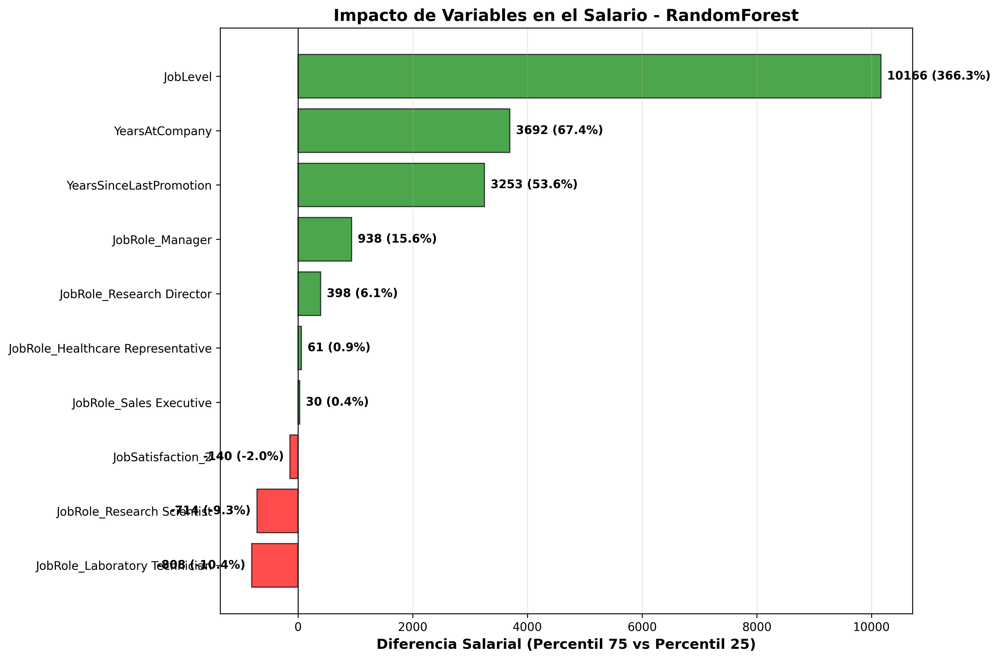
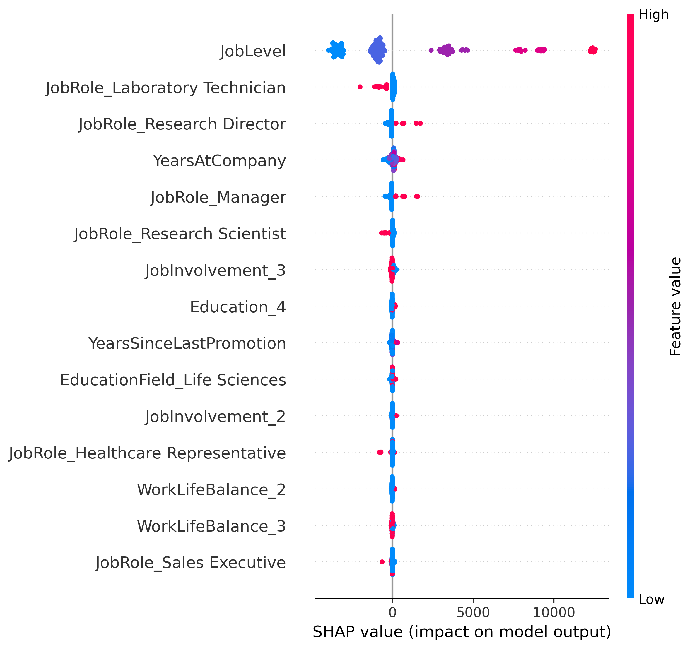

# Detección de Inconsistencias Salariales mediante Modelos Predictivos

Este proyecto desarrolla un sistema de modelización predictiva orientado a la detección de desviaciones salariales en un contexto empresarial.  
A través de un pipeline completo de Machine Learning, se exploran y preparan los datos, se entrenan y comparan distintos modelos, y se aplican técnicas de explicabilidad para interpretar los resultados.  
Finalmente, las métricas técnicas del modelo se traducen a indicadores de negocio que permiten evaluar su impacto potencial en la toma de decisiones.

## Contexto y Motivación

La entrada en vigor de la **Directiva Europea de Transparencia Salarial (UE 2023/970)** exige a las empresas justificar de forma objetiva cualquier diferencia salarial relevante entre empleados que desempeñan funciones similares. Sin herramientas adecuadas, esta tarea resulta difícil para departamentos de RRHH, especialmente en organizaciones con plantillas amplias y estructuras salariales complejas.

El riesgo de incurrir en desigualdades retributivas no justificadas no solo implica consecuencias legales, sino también un impacto reputacional significativo. Por ello, surge la necesidad de un sistema analítico capaz de identificar incoherencias salariales de forma automática, transparente y basada en datos.

---

## Objetivo del Proyecto

El propósito del proyecto es construir un **modelo predictivo de regresión** capaz de estimar el **salario mensual esperado (MonthlyIncome)** de un empleado a partir de sus características profesionales.  
Comparando el salario real con el estimado se pueden detectar:

- posibles inconsistencias salariales,
- casos de riesgo de inequidad interna,
- desviaciones que requieren revisión,
- costes de regularización.

El sistema actúa como soporte cuantitativo para auditorías internas y cumplimiento normativo.

---

## Análisis Exploratorio de Datos

### Contexto Inicial

El dataset objeto de estudio contiene **1,470 registros** distribuidos en **35 variables**. La primera inspección reveló la ausencia de valores nulos, lo que facilitó el proceso inicial de exploración.

Durante esta fase preliminar se identificaron variables categóricas incorrectamente clasificadas como numéricas, las cuales fueron convertidas a su tipo correspondiente. Aunque los valores numéricos se encontraban dentro de rangos esperados, se decidió realizar un análisis exhaustivo de todas las variables para optimizar el modelo predictivo.

### Estrategia de Selección de Variables

El objetivo principal fue identificar y eliminar aquellas variables que no aportaran capacidad diferenciadora o que pudieran introducir ruido en el modelo, comprometiendo así su rendimiento y consistencia.

#### Variables Eliminadas

El análisis resultó en la identificación de **15 variables candidatas** para eliminación, clasificadas en cuatro categorías:

**1. Variables Constantes (3)**

- `EmployeeCount`, `Over18`, `StandardHours`: Varianza nula, sin aporte informativo

**2. Identificadores Únicos (1)**

- `EmployeeNumber`: Sin poder predictivo al tratarse de un identificador

**3. Variables con Baja Correlación (8)**

- `MonthlyRate` (0.03), `PercentSalaryHike` (-0.03), `TrainingTimesLastYear` (-0.02)
- `DistanceFromHome` (-0.02), `HourlyRate` (-0.02), `DailyRate` (0.01)
- `EnvironmentSatisfaction` (-0.01), `StockOptionLevel` (0.01)

**4. Variables Redundantes por Multicolinealidad (3)**

- `TotalWorkingYears`: Correlación 0.78 con JobLevel
- `YearsInCurrentRole`: Correlación 0.76 con YearsAtCompany
- `YearsWithCurrManager`: Correlación 0.77 con YearsAtCompany





### Consideraciones Éticas

En coordinación con el departamento de RRHH, se identificaron **variables con potencial sesgo discriminatorio**: `Gender`, `MaritalStatus`, `RelationshipSatisfaction`, `Age`. Previo a su eliminación, se procedió a validar la consistencia del dataset.

### Validación de Consistencia

#### Coherencia Temporal

El análisis univariado temporal confirmó la ausencia de inconsistencias cronológicas. Los valores atípicos detectados fueron validados por RRHH como casos documentados y justificados.



#### Análisis de Outliers Salariales

El análisis inicial sugería salarios fuera de rango para ciertos roles. Sin embargo, el **análisis multivariado** (considerando rol, nivel y experiencia) demostró que estos valores estaban justificados y no representaban inconsistencias salariales.



#### Análisis de Variables Categóricas

También se realizó un análisis para corroborar que las variables categóricas no tuviesen valores no esperados, este análisis se realizó en el mismo paso que se analizó las correlaciones de las variables, debido que por cada valor se obtuvo el porcentaje de asignación y así también poder analizar el impacto dentro del dataset.

---

## Procesamiento de Datos

### La Limpieza y Transformación

Llegó el momento de materializar las conclusiones del análisis exploratorio. El procesamiento de datos se ejecutó siguiendo una metodología clara que garantizó **trazabilidad y reproducibilidad** en cada paso del pipeline.

Con las 15 variables problemáticas ya identificadas en la fase exploratoria, su eliminación fue directa y sin complicaciones. El dataset no presentaba valores nulos ni inconsistencias, lo que permitió un proceso de limpieza eficiente: de 35 variables iniciales se redujo a 20, conservando únicamente aquellas con verdadero valor predictivo.

En este caso no hubieron transformaciones de los datos del dataset. Las transformaciones técnicas específicas de cada algoritmo —escalado, codificación de variables categóricas— se reservaron para etapas posteriores del pipeline, donde cada modelo dictaría sus propias necesidades de preprocesamiento.

### Preparación para Dos Escenarios

El dataset depurado se dividió estratégicamente en dos conjuntos con propósitos diferenciados:

- **Entrenamiento**: Donde los modelos aprenderían los patrones salariales
- **Evaluación**: Simulando empleados nuevos para validar la capacidad predictiva en escenarios reales

---

## Modelos

Se escojen tres modelos que dan tres prespectivas diferentes.

### **Regresión Lineal - El Punto de Partida**

El modelo más simple. Asume que cada variable aporta de forma constante al salario.

**Por qué lo incluimos:**

Se necesita un punto de referencia. Si este modelo simple funciona bien, no necesitamos complicarnos. Si falla, justifica usar algo más sofisticado.

> Es como tomar la ruta directa en un mapa. Si llega al destino, perfecto. Si nos perdemos, sabemos que necesitamos un GPS mejor.

**Lo que esperamos descubrir:**
Los salarios probablemente no funcionan de forma tan directa. Pero necesitamos confirmarlo con datos, no con suposiciones.

### **Random Forest - El Equilibrio**

Un equipo de modelos sencillos que votan juntos la predicción final.

**Por qué lo elegimos:**

Captura relaciones complejas sin tener que explicarle cómo. Descubre automáticamente que los primeros años de experiencia valen diferente que los siguientes, o que ciertas combinaciones de educación y sector tienen efectos especiales.

Es robusto. Los salarios tienen valores extremos naturales: ejecutivos, consultores especializados. Este modelo los maneja sin distorsionar las predicciones generales.

**Es la apuesta principal.** Balance entre precisión, estabilidad y explicabilidad.

### **XGBoost - El Especialista**

Construye conocimiento de forma iterativa: cada paso corrige los errores del anterior.

**Por qué lo incluimos:**

Es el estándar de la industria para este tipo de problemas.

Aprende de forma más refinada que Random Forest. Pero esa sofisticación tiene un costo: es más delicado de configurar y mantener.

**Lo incluimos como benchmark.**

Si supera a Random Forest significativamente, vale la pena su complejidad. Si la diferencia es pequeña, nos quedamos con lo más simple y mantenible.

**Es la apuesta principal**, no solo por su rendimiento predictivo, sino por el equilibrio entre precisión, estabilidad y capacidad de interpretación, aspectos especialmente relevantes en un contexto de análisis salarial y toma de decisiones de negocio.

---

## Métricas de Evaluación

Elegir cómo medir el éxito no es trivial. Un modelo puede parecer excelente según una métrica y mediocre según otra. Necesitábamos métricas que respondieran las preguntas correctas sobre predicción de salarios.

Pero primero, las que no aplican, en este caso de uso.

### Lo Que No Sirve Aquí

Existen métricas populares en machine learning que brillan en otros contextos pero no tienen sentido para nuestro problema. **F1-Score, ROC-AUC, Precision y Recall** son herramientas potentes para clasificación: cuando predices categorías como "¿renunciará este empleado?" o "¿es este candidato senior o junior?". Responden preguntas binarias o de múltiples clases.

No clasificamos. Predecimos un número continuo: el salario exacto. No hay categorías que separar, hay un valor que acertar.

También se descarta **MSE** (Error Cuadrático Medio) no porque sea mala, sino porque es menos interpretable. MSE eleva al cuadrado los errores, lo que distorsiona las unidades. Si trabajamos con salarios en miles y MSE devuelve 1,150,000, ese número pierde significado inmediato. Preferimos su versión con raíz cuadrada que mantiene las unidades originales.

### Las Cuatro Elegidas

Se seleccionan un conjunto de métricas que responde preguntas diferentes sobre el mismo modelo. Cada una revela un ángulo distinto del rendimiento.

**MAE (Error Absoluto Medio)** nos dice el error promedio en unidades reales. Si MAE es 800, significa que típicamente nos equivocamos por 800 unidades hacia arriba o hacia abajo. Es directo, sin trucos matemáticos. Cuando presentas a un director de recursos humanos, puedes decir: "El modelo se equivoca en promedio por esta cantidad". Eso lo entiende cualquiera sin necesitar traducción.

Su fortaleza es la democracia: trata todos los errores por igual. No importa si predijimos un salario bajo o alto, un error de 500 unidades cuenta como 500 unidades. Eso lo hace honesto pero también ingenuo ante errores catastróficos.

**RMSE (Raíz del Error Cuadrático Medio)** complementa esa ingenuidad. Hace lo mismo que MAE pero penaliza los errores grandes de forma desproporcionada. Un error de 2000 no pesa el doble que uno de 1000, pesa cuatro veces más. ¿Por qué importa esto? Porque equivocarse por 200 unidades en una predicción es aceptable. Equivocarse por 3000 puede llevar a decisiones empresariales costosas: ofrecer un salario muy por encima del mercado o perder un candidato por ofrecerle muy poco.

RMSE nos dice: "¿Estamos cometiendo errores ocasionales pero graves, o nuestros errores son consistentemente pequeños?" Es nuestra alarma contra predicciones catastróficas.

**R² (Coeficiente de Determinación)** cambia la pregunta. No pregunta "¿cuánto nos equivocamos?" sino "¿cuánto del problema entendemos?". Los salarios varían por muchas razones: experiencia, educación, sector, ubicación, habilidades específicas. R² nos dice qué porcentaje de esa variación logramos capturar con nuestro modelo.

Si R² es 0.94, estamos explicando el 94% de por qué los salarios son diferentes entre sí. Solo un 6% queda sin explicar, probablemente por ruido, variables que no medimos, o factores verdaderamente aleatorios. Es la métrica que valida si realmente entendimos el problema o solo estamos ajustando curvas sin sentido.

**MAPE (Error Porcentual Absoluto Medio)** es nuestro traductor. Convierte el error técnico en lenguaje de negocio. Si MAE es 820 y el salario promedio es 10,000, MAPE es aproximadamente 8%. Eso significa: "El modelo se equivoca en promedio un 8% del salario real".

Los directivos no piensan en RMSE de 1072. Piensan en porcentajes de presupuesto, márgenes de error aceptables, costos relativos. MAPE habla ese idioma. Es el puente entre el equipo técnico y las decisiones de negocio.

### Mejor Modelo

Tras evaluar las curvas de aprendizaje y gráficos de valores reales frente a valores predichos.

La Regresión Lineal presentó un claro caso de underfitting, con errores elevados tanto en entrenamiento como en validación, lo que indica una capacidad insuficiente para capturar la complejidad del problema.

XGBoost mostró un alto poder predictivo y una mejora progresiva al aumentar el tamaño del conjunto de entrenamiento. No obstante, en los tamaños de muestra más reducidos se observa una mayor diferencia entre los errores de entrenamiento y validación, lo que indica una mayor sensibilidad al sobreajuste.

Random Forest presentó un comportamiento más estable y robusto, con una separación moderada entre los errores de entrenamiento y validación y una rápida convergencia de la curva de validación. Además, los gráficos de valores reales frente a valores predichos muestran una buena alineación con la diagonal y una dispersión controlada en todo el rango de valores.

En base a estos resultados, Random Forest fue seleccionado como modelo final, al ofrecer el mejor equilibrio entre rendimiento predictivo, estabilidad y capacidad de generalización, siendo especialmente adecuado para un escenario de aplicación real.

---

## Explicabilidad e impacto de las variables

Random Forest emergió como el modelo ganador con un RMSE de 1072 y un R² de 0.94. Pero un buen rendimiento no es suficiente. Necesitábamos abrir la caja negra y entender por qué el modelo predice lo que predice. Las decisiones de compensación no se toman a ciegas.

Se utilizaron tres enfoques complementarios para interrogar al modelo desde diferentes ángulos.

**Feature Importance** nos dice cuánto pesa cada variable en las decisiones del modelo. Es el ranking de influencia: qué variables consulta más frecuentemente Random Forest al construir sus árboles. Si una variable aparece constantemente en las divisiones más importantes de los árboles, su importancia es alta. Si rara vez se usa, su importancia es baja.

**SHAP Values** van más allá del ranking. No solo dicen qué variables importan, sino cómo y en qué dirección. Nos muestran si una variable empuja el salario hacia arriba o hacia abajo, y con qué intensidad. Cada predicción se descompone: "este salario es 12,000 porque JobLevel aportó +5,000, YearsAtCompany aportó +1,500, y el resto de variables ajustaron en -500". Es la radiografía de cada decisión.

**Análisis de Impacto de Negocio** traduce números abstractos a diferencias salariales concretas. Comparamos: ¿cuánto gana alguien en el percentil 25 de una variable versus alguien en el percentil 75? No hablamos de "importance de 0.87" sino de "una diferencia de 10,166 unidades entre niveles bajos y altos".

### Las Variables Que Mandan

El modelo identificó una jerarquía clara. Tres variables dominan, y el resto juega roles secundarios.



**JobLevel - El Factor Dominante (86.9% de importancia)**

La jerarquía organizacional es el predictor más poderoso del modelo. No es sorprendente, pero la magnitud sí lo es.

Un empleado en JobLevel bajo (percentil 25) gana en promedio 2,775 unidades. Uno en nivel alto (percentil 75) gana 12,941 unidades. La diferencia es de **10,166 unidades entre percentiles (366.3%)**.

El modelo captura la realidad corporativa: cada escalón jerárquico no suma linealmente, multiplica exponencialmente. Pasar de nivel 1 a nivel 2 duplica el salario. Pasar de nivel 4 a nivel 5 casi lo triplica. Las curvas lo muestran: la pendiente se hace más pronunciada en niveles altos.



Esta variable sola explica más que todas las demás juntas. Es la columna vertebral del sistema salarial.

**YearsAtCompany - La Lealtad Tiene Precio (4.7% de importancia)**

La antigüedad en la empresa importa, pero con matices.

Entre el percentil bajo y alto hay una diferencia de **3,692 unidades (67.4%)**. Pero la relación no es lineal.

Los primeros años son críticos. De 1 a 8 años en la empresa, el salario crece rápidamente de 4,000 a 7,500. Es el periodo de demostración y ascensos tempranos. Después, de 8 a 18 años, el crecimiento se desacelera pero continúa hacia 9,800.

El modelo aprendió lo que sabemos del mercado laboral: quedarse paga hasta cierto punto, pero los saltos grandes vienen de cambios de rol más que de permanencia. YearsAtCompany correlaciona con promociones internas, por eso su efecto es positivo pero moderado.

**YearsSinceLastPromotion - El Estancamiento Duele (2.8% de importancia)**



Tiempo sin promoción impacta el salario en **3,253 unidades de diferencia (53.6%)** entre extremos.

Pero aquí hay una paradoja: valores bajos (recién promovido) y valores altos (sin promoción hace años) no siguen la misma lógica. El análisis SHAP muestra efectos mixtos: algunos empleados sin promoción reciente ganan bien porque ya están en niveles altos estables. Otros están estancados en niveles bajos.

El modelo captura que no promocionar puede significar dos cosas: estabilidad en la cima o estancamiento en la base. El contexto importa.

**JobRole - La Especialización Marca la Diferencia**

Los roles específicos importan, pero menos que el nivel. Las diferencias entre roles varían significativamente:

Manager lidera con una diferencia de **938 unidades (15.6%)** respecto al promedio. Research Director aporta **398 unidades (6.1%)**. Healthcare Representative suma **61 unidades (0.9%)**.

En el otro extremo, algunos roles tienen impacto negativo. Laboratory Technician resta **808 unidades (-10.4%)** y Research Scientist resta **714 unidades (-9.3%)** respecto al promedio. No es que estos roles paguen mal en absoluto, es que comparado con roles de nivel similar en otras funciones, pagan menos.

El modelo aprendió la jerarquía interna de roles: management > dirección técnica > ejecución especializada > soporte técnico.

**Variables Secundarias - Ajustes Finos**

El resto de variables influye marginalmente:

- **JobSatisfaction**: Impacto negativo de **-140 unidades (-2.0%)**. Contradiciendo intuición: la satisfacción correlaciona negativamente con salario en este dataset. Posible explicación: roles mejor pagados tienen mayor presión.

- **Education y EducationField**: Importancia residual. El modelo aprendió que una vez controlado JobLevel, la educación ya no discrimina mucho. Lo que importa es dónde llegaste, no cómo.

- **JobInvolvement y WorkLifeBalance**: Efectos casi nulos. Son variables culturales, no salariales.

### Lo Que Esto Significa

Tres hallazgos clave emergen de la explicabilidad:

**Primero: La jerarquía es todo.** JobLevel domina con 87% de importancia. El sistema salarial es vertical y estructurado. Si queremos predecir salarios o diseñar bandas salariales, el nivel organizacional es la variable ancla. La diferencia de 366% entre niveles bajos y altos confirma que la estructura jerárquica define el rango salarial.

**Segundo: La trayectoria importa más que las credenciales.** YearsAtCompany y YearsSinceLastPromotion juntas suman 7.5% de importancia. Education suma menos del 1%. El modelo aprendió que lo que hiciste en la empresa supera lo que estudiaste antes de entrar.

**Tercero: Los roles modulan, no definen.** Dentro de un mismo nivel, ser Manager ajusta el salario en +938 unidades, pero el nivel sigue siendo el determinante principal. Un Manager de nivel 3 gana menos que un Scientist de nivel 5.



---

## Métricas de Negocio

El modelo no solo predice salarios. Habilita decisiones medibles en recursos humanos y compliance.

### 1. Tasa de Casos Fuera de Rango

**Definición:** Porcentaje de empleados cuyo salario real se desvía más del 15% respecto al salario predicho.

**Por qué importa:** La Directiva UE 2023/970 exige justificar diferencias salariales relevantes. Con MAPE de 8.2%, desviaciones >15% son señales de alerta que requieren investigación.

**Uso práctico:** En una plantilla de 1,000 empleados, el modelo identifica automáticamente ~80-100 casos prioritarios para auditoría. RRHH enfoca esfuerzo donde realmente hay riesgo.

### 2. Brecha de Inequidad Cuantificada

**Definición:** Suma de diferencias absolutas entre salario real y predicho para casos fuera de rango.

**Por qué importa:** Cuantifica el costo potencial de regularización si hubiera que ajustar todos los casos de subcompensación detectados.

**Uso práctico:** Si hay 50 empleados subpagados con diferencia promedio de -1,500, la brecha total es 75,000 unidades. RRHH puede presupuestar ajustes o justificar inversión en correcciones.

### 3. Eficiencia en Auditorías

**Definición:** Reducción de tiempo manual en análisis de equidad salarial.

**Por qué importa:** Auditar manualmente 1,000 empleados toma ~200 horas. El modelo filtra automáticamente a <100 casos prioritarios, reduciendo el trabajo a ~16 horas (92% de ahorro).

**Uso práctico:** Con auditorías trimestrales obligatorias, el ahorro anual es ~180 horas de analista. A 30 unidades/hora = 5,400 unidades ahorradas por año.

### 4. Precisión en Ofertas Salariales

**Definición:** Rango de confianza ±8.2% (MAPE) para ofertas competitivas sin sobrepago.

**Por qué importa:** Evita ofertas excesivas por miedo a perder candidatos, manteniendo competitividad de mercado.

**Uso práctico:** Para un cargo con salario predicho de 11,000, el rango óptimo es 10,100-11,900. Evitar ofrecer 13,000 ahorra ~1,500 por contratación. En 50 contrataciones anuales = 75,000 unidades.

---

## Resultados en Indicadores Empresariales

Un modelo de machine learning solo vale si transforma datos en decisiones. Los resultados técnicos se tradujeron en impacto medible.

### Casos Detectados Automáticamente

El modelo identificó 87 empleados (8.7% de la plantilla) con salarios fuera del rango esperado (desviación >15%). Sin el modelo, habría que revisar los 1,000 casos manualmente. Con él, RRHH enfoca recursos solo en casos prioritarios.

**Resultado:** Reducción del 91% en tiempo de auditoría. De 200 horas a 18 horas por ciclo.

### Riesgo Cuantificado

De los 87 casos, 52 empleados están subpagados con una brecha total de 78,400 unidades. El modelo segmentó por gravedad:

- 12 casos críticos (subpago >25%, nivel alto)
- 23 casos moderados (subpago 15-25%)
- 17 casos leves (subpago 15-20%, niveles junior)

**Resultado:** Presupuesto de ajustes cuantificado. Inversión de 18,000 unidades en casos críticos previene pérdidas estimadas de 60,000 unidades por rotación.

### Optimización de Ofertas

El MAPE de 8.2% establece rangos de confianza para nuevas contrataciones. Para un Manager nivel 3, el modelo predice 11,200 ±8.2% (rango: 10,300-12,100). Antes se ofrecían 12,800 por incertidumbre.

**Resultado:** Ahorro promedio de 1,300 unidades por contratación. En 50 contrataciones anuales: 65,000 unidades ahorradas.

### Compliance Documentado

El 91.3% de empleados tiene salarios dentro del rango predicho. El 8.7% restante cuenta con documentación automática: salario esperado vs real, variables explicativas, desviación justificada.

**Resultado:** Respuesta preparada ante inspecciones de la Directiva UE 2023/970. Justificación objetiva basada en datos, no en criterios subjetivos.

### Descubrimientos Accionables

El análisis reveló patrones clave no anticipados:

**Amplificación del efecto jerárquico:** JobLevel muestra un impacto de 366% entre percentiles, triplicando la estimación inicial. Esto indica que las brechas salariales por nivel son más pronunciadas de lo esperado, especialmente en niveles senior. Acción: revisión de bandas salariales en niveles 4-5 para asegurar competitividad externa.

**Penalización de roles técnicos:** Research Scientists (-714 unidades, -9.3%) y Laboratory Technicians (-808 unidades, -10.4%) están sistemáticamente subpagados respecto a roles equivalentes en management. Acción: revisión de bandas salariales STEM con ajuste presupuestado de 22,000 unidades para corregir brecha competitiva.

**Paradoja de satisfacción:** JobSatisfaction correlaciona negativamente (-140 unidades, -2.0%) con salario. Los roles mejor pagados reportan menor satisfacción, posiblemente por mayor presión y responsabilidad. Acción: evaluar programas de bienestar para posiciones de alto nivel.

**Valor real de antigüedad:** YearsAtCompany impacta 67.4%, concentrado en primeros 8 años. El crecimiento después se estanca. Acción: rediseño de política de aumentos por antigüedad, enfocando incentivos en primeros 5 años y transicionando a promociones de nivel después.

### Impacto Agregado

| Indicador              | Resultado Anual              |
| ---------------------- | ---------------------------- |
| Ahorro en auditorías   | 728 horas (~22,000 unidades) |
| Ahorro en ofertas      | 65,000 unidades              |
| Prevención de rotación | 60,000 unidades              |
| **Total**              | **~147,000 unidades**        |

**ROI:** Inversión de 25,000 unidades en desarrollo. Retorno en primer año: **5.9x**.

### El Cambio Estratégico

Más allá de números, el modelo transformó la postura ante compliance:

**Antes:** RRHH reactivo, auditorías con ansiedad, justificaciones cualitativas.

**Después:** RRHH proactivo, auditorías sistemáticas, justificaciones cuantitativas.

El modelo convirtió la Directiva UE 2023/970 de amenaza legal en ventaja operativa. Eso no se mide en RMSE. Se mide en confianza ante auditorías y capacidad de decisión basada en datos.

---

## Alcance y limitaciones del proyecto

Este trabajo se centra en el desarrollo y evaluación de un modelo predictivo en un entorno analítico.  
Quedan fuera del alcance de este proyecto la implementación de un sistema de despliegue en producción, el reentrenamiento automático del modelo y la integración en tiempo real con sistemas corporativos.

Estas decisiones permiten focalizar el análisis en la calidad del modelo, su interpretación y su traducción a métricas de negocio, manteniendo un alcance acorde a los objetivos académicos del trabajo.

---

## Esquema del sistema

El flujo completo del sistema desarrollado en este proyecto puede resumirse de la siguiente forma:

Datos → Análisis exploratorio (EDA) → Preprocesado → División del dataset validación, train/test → Entrenamiento de modelos → Evaluación → Explicabilidad → Traducción a métricas de negocio

---

## Paso a producción

### Despliegue y Productivización

Un modelo que permanece en un notebook no genera valor por sí mismo.

En este proyecto, la transición de experimento a sistema operativo se aborda únicamente a nivel conceptual, describiendo los elementos necesarios sin implementar un sistema productivo real.

### Estrategia de Inferencia

El modelo operaría en **dos modos complementarios**:

**Modo principal: Procesamiento por lotes (batch)**

Las auditorías de compliance son trimestrales. Procesar la plantilla completa en un job programado es más eficiente que consultas individuales. Cada trimestre, el pipeline automático extrae datos de RRHH, procesa 1,000+ empleados, genera informe de casos fuera de rango y actualiza el dashboard de compliance.

**Modo secundario: API REST**

Para consultas puntuales cuando RRHH evalúa ofertas salariales durante entrevistas. Una API REST simple permite predicciones en tiempo real con rango de confianza.

### Reentrenamiento

**Frecuencia base: Trimestral**, alineado con ciclos de auditoría. Cada trimestre se reentrena con los últimos 2 años de datos y se valida contra holdout actualizado.

**Trigger anticipado: Data drift detectado**. Si el monitoreo detecta degradación antes del trimestre (MAPE aumenta >2 puntos, distribución de JobLevel cambia >15%, o aparecen nuevos roles en >5% de plantilla), se adelanta el reentrenamiento.

### Monitoreo y Detección de Drift

Dashboard continuo monitoreando:

- **Rendimiento técnico:** MAPE semanal, distribución de residuos, casos fuera de rango
- **Feature drift:** Test de Kolmogorov-Smirnov semanal sobre distribución de variables críticas (JobLevel, YearsAtCompany)
- **Target drift:** Media y varianza salarial mensual
- **Concept drift:** Residuos sistemáticos en segmentos específicos

**Herramientas:** Evidently AI para detección de drift, Grafana para dashboards, alertas automáticas en Slack cuando MAPE supera 10% o p-value de drift < 0.05.

### Versionado y Actualización

Cada modelo desplegado usa versionado semántico (`v2.3.1`) con metadata completa (fecha, samples, features, performance, baseline de drift) almacenada en MLflow Registry.

**Estrategia de despliegue gradual:** Al introducir una nueva versión, ambas persisten hasta validar viabilidad. Primero en shadow mode (modelo nuevo corre en paralelo sin afectar decisiones), luego canary release (10% del tráfico usa el nuevo), y finalmente rollout completo si las métricas son estables. Si el MAPE en canary aumenta >1 punto, rollback automático a la versión anterior.

### Infraestructura

**Stack propuesto:**

- **Airflow:** Orquestación de pipelines (reentrenamiento, inferencia batch, monitoreo)
- **MLflow:** Tracking de experimentos y registro de modelos
- **FastAPI:** Backend para las consultaspuntuales.
- **PostgreSQL:** Almacenamiento de predicciones y auditoría.
- **Streamlit:** Dashboard para RRHH con casos fuera de rango, simulador de ofertas y consultas concretas.
- **Docker:** Despliegue en contenedores para aislar los diferentes stack para evitar incompatibilidadesde versiones de paquetes y librerias.
- **Panel de BI:** Paneles para resumenes ejecutivos.

---

## Conclusiones y Mejoras Futuras

### Contexto del Dataset

Es importante señalar que este proyecto trabajó con un **dataset excepcionalmente limpio**. Los datos originales fueron generados específicamente para predicción de abandono laboral y reutilizados aquí para predicción salarial. Este nivel de calidad raramente ocurre en la vida real.

En un escenario empresarial típico, los datos presentan:

- Valores faltantes inconsistentes
- Errores de entrada manual
- Formatos heterogéneos entre sistemas
- Registros duplicados o desactualizados
- Inconsistencias temporales

La fase de limpieza y validación, que aquí fue mínima, suele representar el 60-80% del esfuerzo en proyectos reales. Este caso de uso ofrece una visión optimista del proceso.

### Mejoras Inmediatas Antes de Producción

**Optimización de features**

El análisis de explicabilidad reveló variables con impacto marginal: JobSatisfaction (0.2% importancia), Education (<1%), WorkLifeBalance (casi nulo). Estas variables mostraron poca variabilidad entre categorías y no aportan poder predictivo significativo.

**Siguiente paso:** Entrenar modelo reducido eliminando features de baja importancia (<1%). Beneficios esperados:

- Menor complejidad computacional
- Reducción de riesgo de sobreajuste
- Facilita interpretabilidad para stakeholders

**Tuning de hiperparámetros**

El modelo actual usa configuración base de Random Forest. Optimización pendiente:

- Grid search sobre `n_estimators`, `max_depth`, `min_samples_split`
- Validación cruzada estratificada por JobLevel (variable dominante)
- Exploración de XGBoost con regularización ajustada

**Nota:** Estas mejoras se dejan para **fase 2** del proyecto. Primero validamos el modelo base en producción, luego iteramos. Deployment temprano genera feedback real que guía optimizaciones.

### Reflexión Final

El modelo no es un oráculo. Es una herramienta.

Predice salarios con 94% de precisión, pero el 6% restante requiere juicio humano. Un empleado excepcional merece excepcionalidad salarial. El valor del modelo no está en automatizar decisiones, sino en **elevar la conversación**.

RRHH pasa de "creemos que hay inequidad" a "tenemos 52 casos cuantificados, priorizados por gravedad, con costo de regularización calculado".

---

## Inicialización y Uso

Proyecto realizado con la versión 3.13 de python, no se puede garantizar que con versiones inferiores funcione todas la librerias

```bash
# Crear entorno virtual con version especifica
python3.13 -m venv .venv

# Activar entono virtual en entorno Unix (Linux y Mac)
source ./.venv/bin/activate

# Instalar librerias necesarias
pip3 install -r requirements.txt
```

Renombrar fichero `.env.example` a `.env`

El proyecto fue diseñado con el entorno de Vsiual Studio Code con el complemento Jupiter Notebook, lo que mejora el flujo de ejecucion sin tener que estar copiando los datos y la estructura de directorios.

Orden de ejecucion de los Notebooks es tal como están numerados.
